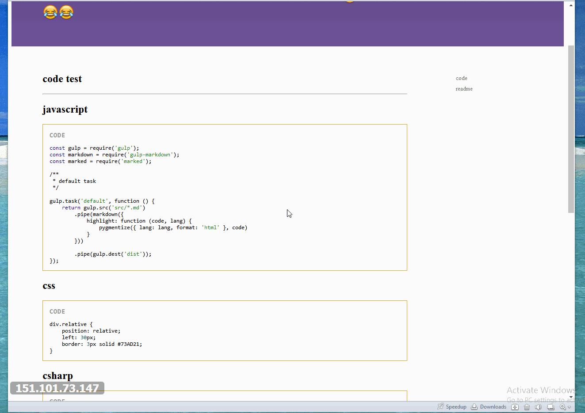
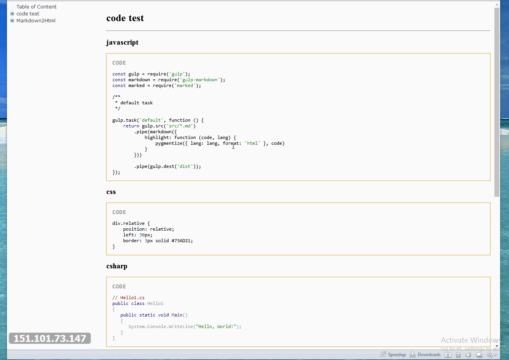

# Markdown2Html(摆出来纪念一下青春)
本工程将markdown文档编译成html文档，并且将编译后的html文档整合为API文档
----------
## Brief
[在线DEMO](https://advence-liz.github.io/markdown2html/index.html)

```bash
$ npm install 下载依赖
$ npm start 
$ gulp ztree --path md//将指定路径下的markdown文档转为html然后生成ztree风格的API文档

$ gulp toc --path md//将指定路径下的markdown文档转为html然后生成bootstrap风格的API文档
```
## 大概这个样子
### TOC

### Ztree

## 目录结构
- root
  + html //markdown 编辑成html所存放位置
  + md //markdown 原文件所存放位置
  + gulpfile.js //编辑markdown 逻辑
  + template //模板存放目录
## Ref
- [art-template](https://github.com/aui/art-template)
- [pygmentize](https://github.com/rvagg/node-pygmentize-bundled)
- [pygmentize segmentfault create pygmentize.css](https://segmentfault.com/a/1190000000661337)
- [highlight.js  看着完美符合gulp markdown 转化出来的文档](https://github.com/isagalaev/highlight.js)
- [highlight sytle](https://highlightjs.org/static/demo/)
- [remarkable](https://github.com/jonschlinkert/remarkable)
- [markdown相关工具](http://www.jianshu.com/p/34c92cbd0aaf)
- [ztree](http://ruby-china.org/topics/17028)
